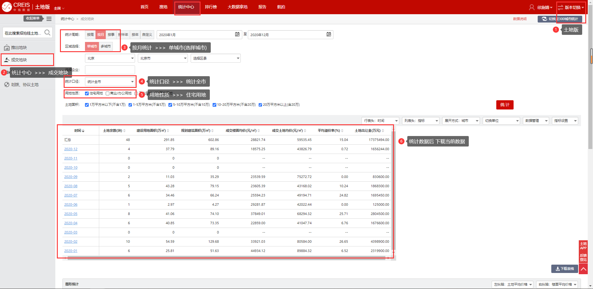
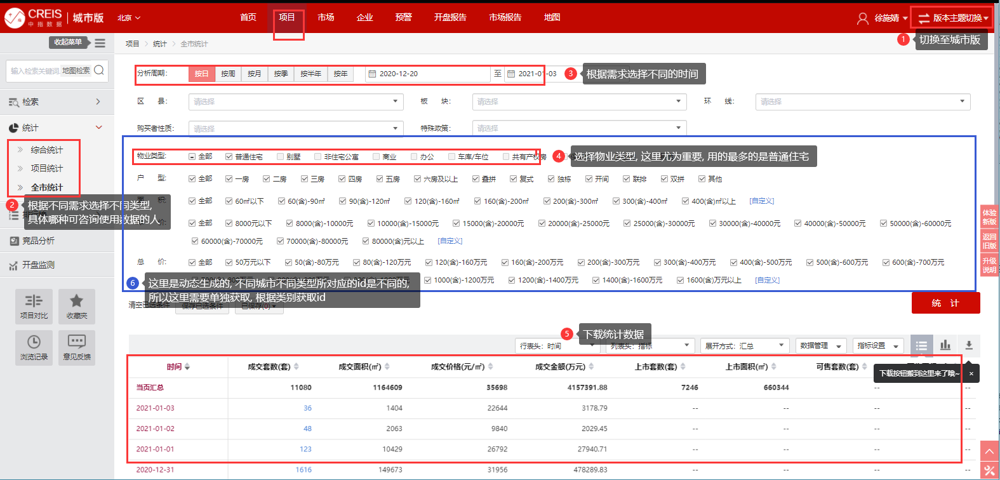
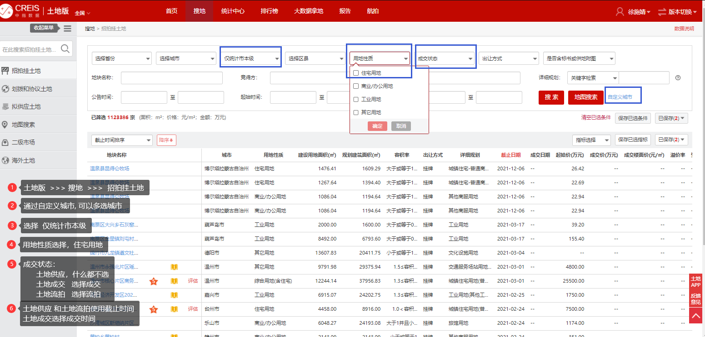
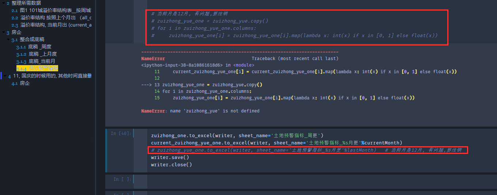
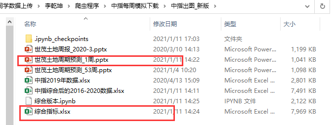

**==不用这个代码可以自己再写一份, 网站不复杂==**

网站: https://creis.fang.com/land/search/Index

账号问辉总拿,  下载延时 需在5-10s

## 9.1 中南锦时

数据所在位置和查询步骤
当前所用的是老版, 新版略有不同, 整体步骤相同, 可亲自测试

- 程序位置: `中指/中南锦时151城/中南锦时.py`

- 更新时间: 辉总会告知, 基本上都是在月初更新上个月的数据

- 说明:

  请修改开始和结束时间, `TODO`处, 

  程序会抓取`Start_Date, End_Date`这段时间的数据, 并替换之前历史中的包含这段时间数据.

  `Start_Date, End_Date`时间最长间隔为36个月

## 9.2 项目成交

这里数据用的是AES加密, 

> 偏移量vi: `timestamp`
> data: `data`
> 加密类型： CTR

数据所在位置和查询步骤

当前所用的是老版, 新版略有不同, 整体步骤相同, 可亲自测试



- 位置: `中指/项目成交/.*.py`

  之前的需求, 我已经写了4个程序, 可供参考或使用. 基本上这部分代码格式差不多,

  函数`get_params_id`对应图中的第:six:点 可根据不同需求修改, 自己写最好

## 9.3  世茂土地周期(周更)

### 9.3.1 获取数据

一共分5步, 分别是

`1. 土地供应明细.py`, 
`2. 土地成交明细.py`, 
`3. 土地流拍.py`, 
`4. 房企拿地.py`, 
`5. 房企融资.py`



其中 :one:,​  :two:,  :three: ==每次查询最多显示750条信息==, 数据有加密, 加密demo 已经写在`解密demo.py`中, 直接调用即可

1. 土地供应明细

   - 在`土地供应明细.py`中搜索`TODO`, 修改开始和结束时间,
     开始时间:  当前时间需要向前推二十来天,  
     结束时间:  必须往后推一个月 
2. 土地成交明细
   - 在`土地成交明细.py`中搜索`TODO`, 修改开始和结束时间,
     开始时间:  需要向前推20-30天,  
     结束时间:  上周日
3. 土地流拍
   - 同土地成交, 因为数据很少,故开始时间时间要求少
4. 房企拿地
   - 在`企业版  >>  竞企分析`模块中, 具体位置复杂, 需要重写程序 可以问甲方.
   - 时间修改同土地成交
5. 房企融资
   - 没要求, 直接运行即可

以上程序执行完毕后, 请运行`世贸土地周期/data/房企拿地/组合数据.py`, 将新数据和历史数据进行合并.
同时要修改`组合数据.py`中TODO出的时间,使其和对应文件中的开始和结束时间相同.

之后再新生成的==`中指综合后的2016-2020数据.xlsx`==, 数据拷贝到jupyter工作文件中, 自动生成PPT和两个excel文件, 将文件发送给甲方

### 9.3.2  生成最终报告

- 将上面最终生成的数据`中指综合后的2016-2020数据.xlsx`分别拷贝到`./中指数据处理he出图/数据整理`和`./\中指出图_新版`中, 

- 运行 [综合版本.ipynb](爬虫程序\中指每周模拟下载\中指出图_新版\综合版本.ipynb) 

  修改 第二步中的时间

  ```python
  # 上一周
  currentWeek = 1
  # 当前年份 
  currentYear = 2021
  
  # 上一周的起始日期
  st = '2021.1.03'
  ed = '2021.1.10'
  
  ```

- 运行 [19-20_出指标预警_布局_融资.ipynb](爬虫程序\中指每周模拟下载\中指数据处理he出图\2019到2020过渡\19-20_出指标预警_布局_融资.ipynb) 

  修改时间

  ```python
  # 全局  当前周(实际为上周) / 当前月 / 上一个月
  currrnt_year = 2021
  currentWeek = 1
  currentMonth = 1
  lastMonth = 12
  ```

  由于程序问题, 标题 2.2, 和3.1.2会出错,直接手动运行, 跳过即可
  这里在1月份的时候需要注销
  

  最后检查文件, 修改下bug
  把`中指出图_新版`下的`综合指标.xlsx`和`世茂土地周报_{上一周}周.pptx` 
  还有`中指数据处理he出图/数据整理`下的`世茂指标预警_{上一周}周.xlsx`三个文件发给甲方,

  最新生成的文件

  |                                                              |                                                              |
  | ------------------------------------------------------------ | ------------------------------------------------------------ |
  |  |  |


