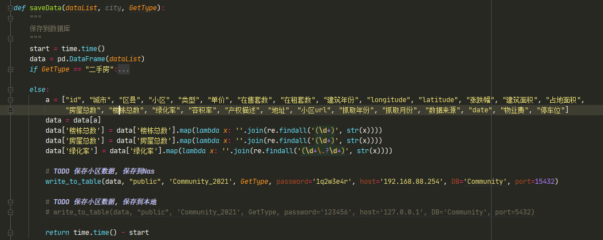

# 6. 房天下

**==不用这个代码可以自己再写一份, 网站不复杂==**

## 6.1 新房

运行`新房.py`

每次运行, 请修改 `if __name__ = "__main__"`下边的 `month`为当前月

新房数据储存在本地库, 首次运行, 请建立新的数据库, 或者自己修改符合自己使用的数据格式.

查看保存数据,请搜索`TODO 保存到本地的 新房库` 即可找到函数`write_to_table`

**备注**

​	新房数据数据需要地理编码, 原数据只有地址, 没有经纬度, 请编码后再导入NAS的数据库.

## 6.2 小区

- 运行:

  - `xiaoqu.py`
  - 修改月份, 同之前一样

  > 
  >
  > 因为没有根据月份判断log, 所以,请在运行前删除 `log>小区`[]中的记录
  >
  > `log>小区`:  记录当前月已经抓取的城市和对应的区县

- 数据保存

  小区数据默认保存在NAS的数据库中, 若要修改位置, 请在`save_date.py`的`saveData`中修改, 或者在`xiaoqu.py`中搜索函数`saveData`, 修改保存数据.

  

## 6.3 二手房

- 运行:

  - `二手房.py`
  - 修改月份, 

  > 因为没有根据月份判断log, 所以,请在运行前删除 `log>lose_dist`[]中的记录
  >
  > `log>lose_dist`:  记录当前月已经抓取的城市和对应的区县

  > 二手房 会检测数据库中已经存在的城市和小区, 并配合本地缓存一起使用, 有所修改请需要修改函数`get_everyone_city_region`,
  > 本地缓存是因为有些区县没有数据, 存入不到数据中, 为防止下次抓取数据时在抓取这部分区县, 故将次保存下来.

- 数据保存

  小二手房数据默认保存在NAS的数据库中, 若要修改位置, 请在`save_date.py`的`saveData`中修改, 或者在`二手房.py`中搜索函数`saveData`, 修改保存数据. 位置方式同小区

