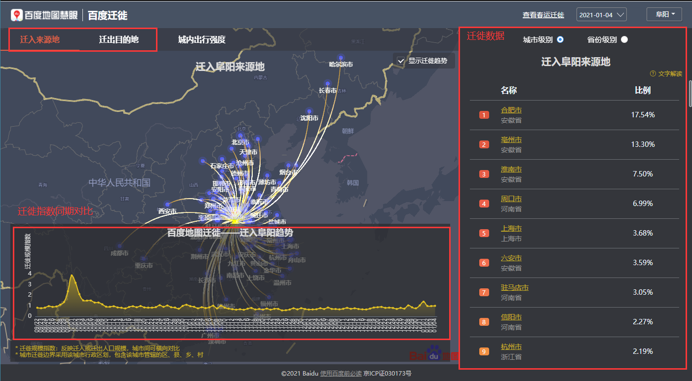

# 1. 百度迁徙

**==不用这个代码可以自己再写一份, 网站不复杂==**

网址: https://qianxi.baidu.com/?city=0#city=0

百度迁移分`百度迁徙指数_同期对比`和`迁徙数据`, 如图

**1. 更新时间**

​	两个月内, 有人需要最新立即更新

**2. 说明**

- 迁徙数据

  启动文件`迁徙.py`,

  执行前, 请根据上次抓取记录, 修改文件中的`start_date`和`end_data`, 格式`xxxx-xx-xx`, 由于excel存储范围有限, 所以此处的时间间隔建议20天, 

- 迁徙指数_同期对比

  启动文件`迁徙指数_同期对比.py`

  执行前, 请根据上次抓取记录, 修改文件中的`start_date`和`end_data`, 格式`xxxx-xx-xx`

**3. 位置**

​	程序：`个人库:\离职同学数据上传\李乾坤\爬虫程序\百度迁徙`

​    数据程序执行完毕后, 请将数据保存到

​	`公用库:\数据文件库\爬虫数据\周期\百度迁移人口流动指数`